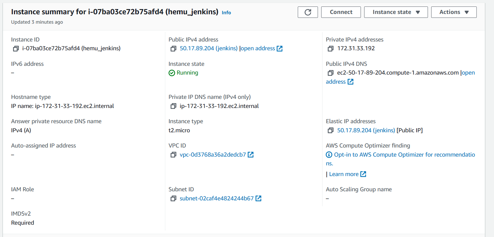
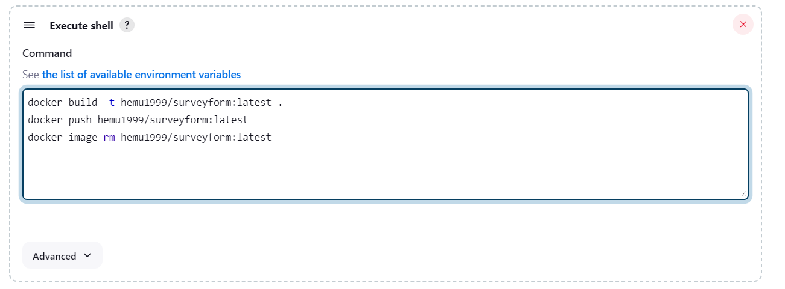
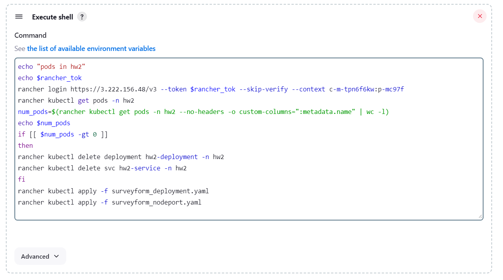
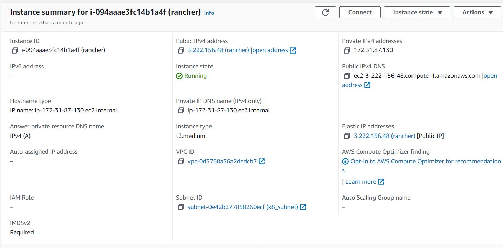
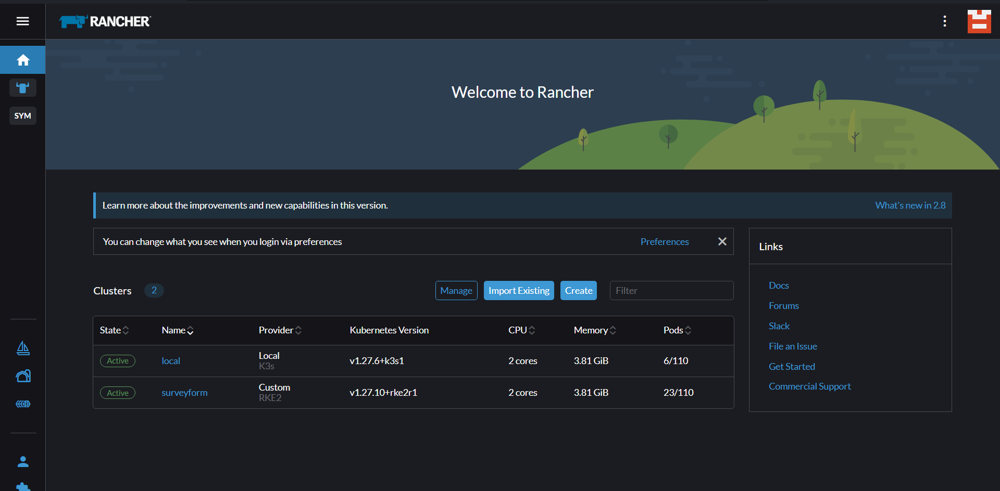
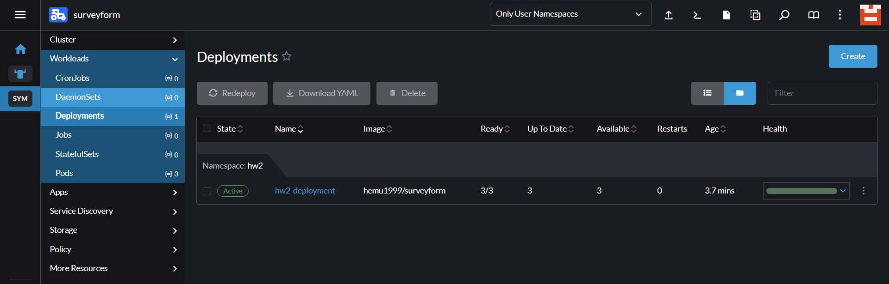
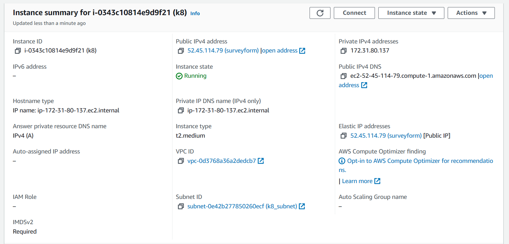
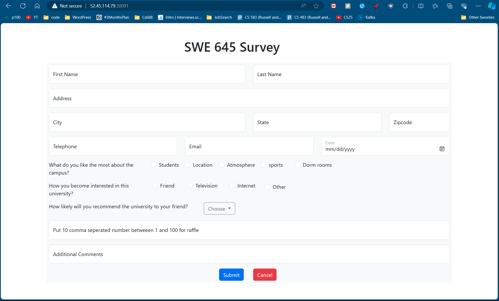
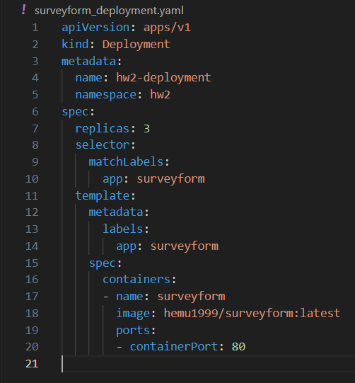
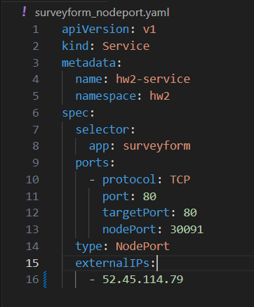

# SWE 645 Assignment 2
## Group Members
- Venkata Sai Ayyappa Hemanth Duddu (G01413649)
- Uddip Yalamanchili (G01409008)
- Divesh Upreti 
# Overview
We have created 3 EC2 instances namely, k8, rancher and jenkins. On the hosted Jenkins EC2 Node, we installed jenkins, docker and rancher cli. On k8 EC2 we have installed docker and rancher agent while one rancher EC2, we have installed docker and created a contianer of rancher stable version.
### Jenkins EC2 details:

#### Jenkins shell jobs:
##### docker job to build and push the new image:

##### docker job to remove old deployment and do a fresh deployment via rancher

### Rancher EC2 details:

#### Rancher cluster details:

#### Rancher deployment details:

### kubernetes EC2 details:

#### Home Page Image:



# Setting up the docker things
1. Installed docker container runtime
2. created Dockerfile using nginx and copy
3. docker build -t <Image Name> <path to docker file>
4. docker run --name surveyformc -d -p 8080:80 surveyform
5. docker login hemu1999
5. docker tag surveyform hemu1999/surveyform


# Setting up the jenkins on EC2
- Create t2.micro on AWS, allowing HTTPs and saving the key
- run the following set of commands to install jenkins on EC2 [1]
- Ensure that your software packages are up to date on your instance by using the following command to perform a quick software update:

- `[ec2-user ~]$ sudo yum update –y`
- Add the Jenkins repo using the following command:

- `[ec2-user ~]$ sudo wget -O /etc/yum.repos.d/jenkins.repo https://pkg.jenkins.io/redhat-stable/jenkins.repo`
- Import a key file from Jenkins-CI to enable installation from the package:

- `[ec2-user ~]$ sudo rpm --import https://pkg.jenkins.io/redhat-stable/jenkins.io-2023.key`
- `[ec2-user ~]$ sudo yum upgrade`
- Install Java (Amazon Linux 2023):

- `[ec2-user ~]$ sudo dnf install java-17-amazon-corretto -y`
- Install Jenkins:

- `[ec2-user ~]$ sudo yum install jenkins -y`
- Enable the Jenkins service to start at boot:

- `[ec2-user ~]$ sudo systemctl enable jenkins`
- Start Jenkins as a service:

- `[ec2-user ~]$ sudo systemctl start jenkins`
- You can check the status of the Jenkins service using the command:

- `[ec2-user ~]$ sudo systemctl status jenkins`
- Our jenkins is available at http://50.17.89.204:8080/

## Github setup
- Create an ssh key pair locally 
- add the public key to the github sshkey in the repo settings
- add the private key as the credentials on jenkins
- create a webhook with the payload http://50.17.89.204:8080/web-hook/
- create it

## Jenkins pipeline Setup
- Create a job
- Select `free style project`
- Give a description
- choose github project
- add the github url `https://github.com/hem1999/k8-automated-deployment`
- choose git as SCM
- add repo url
- choose credentials which are already stored in Jenkins Credentials
- make branch to blank so that it will take the default as main.
- choose github hook trigger.
- then add the docker build job as a shell script
```
docker build -t hemu1999/surveyform:latest .
docker push hemu1999/surveyform:latest
docker image rm hemu1999/surveyform:latest
```
- then next job is to deploy on kubernetes
``` 
rancher login https://3.222.156.48/v3 --token $rancher_tok --skip-verify --context c-m-tpn6f6kw:p-mc97f
rancher kubectl get pods -n hw2
num_pods=$(rancher kubectl get pods -n hw2 --no-headers -o custom-columns=":metadata.name" | wc -l)
echo $num_pods
if [[ $num_pods -gt 0 ]]
then
rancher kubectl delete deployment hw2-deployment -n hw2
rancher kubectl delete svc hw2-service -n hw2
fi
rancher kubectl apply -f surveyform_deployment.yaml
rancher kubectl apply -f surveyform_nodeport.yaml
```
- this script will connect to our cluster via rancher, remove the old deployment if exists and deploy with the updated yaml files

### Installing docker on Jenkins Node
- To install docker on jenkins node [2]
- sudo yum update -y
- sudo yum install -y docker
- sudo systemctl start docker
- sudo systemctl enable docker
- giving jenkins user permissions using: sudo usermod -aG docker $USER
- sudo usermod -aG docker jenkins
- Install rancher cli on the node
- get token from the rancher
- use the following script to connect, remove old pods and create new one
### Installing rancher CLI on Jenkins Node
- Install using the instructions on https://github.com/rancher/cli/releases
- Go to rancher on `https://3.222.156.48/`, go to accounts and api key and create one and copy the `Bearer token`
- Save the Bearer token as credential in Jenkins

## Installing rancher
- create a t2.medium instance with 24gb of ebs allowing HTTP & HTTPS with AMI LINUX 2
- `yum update -y` to update the existing packages
- `yum install docker -y` to install docker
- `systemctl enable docker` to enable the system link with docker
- `systemctl start docker` to start the docker service in backend
- `docker run -d --restart=unless-stopped -p 80:80 -p 443:443 --privileged rancher/rancher:stable` use this command to start a rancher container.
- Then go to `ec2-ipaddress:80` to see the rancher dashboard
- run the `docker logs  container-id  2>&1 | grep "Bootstrap Password:"` gives the current password
- use that to create your own new password.
- In the dashboard, click `create`.
- Scroll down and choose `custom` and then click on `create`.
- Then choose the curl command presented on screen, enable the insecure flag.
- copy this command to paste it in the `k8 ec2 machine` to make the cluster on `ec2` manageable with rancher.
#### Setting up the k8 ec2
- create a t2.medium instance with 24gb of ebs allowing HTTP & HTTPS with ubuntu and open the service port `30091` on EC2 security group.
- `sudo apt-get update -y` to update current packages
- `sudo apt-get install docker.io -y` to install docker service, it should automatically create system link, if not follow above systemcl commands to start docker service in the backend.
- paste the rancher agent curl command and click enter. this will make the cluster accessible via rancher.
- Now go to rancher dashboard and start deploying your yaml files.
- below are the 2 yamls we created, the first one is about deployment


- we created a new namespace `hw2`, then named our deployment `hw2-deployment` with selectors as `app: surveyform`.
- The other yaml is about the `NodePort` service deployment with `EXTERNAL_IP` as EC2 elastic IP.




## References
- [1] https://www.jenkins.io/doc/tutorials/tutorial-for-installing-jenkins-on-AWS/
- [2] https://docs.aws.amazon.com/serverless-application-model/latest/developerguide/install-docker.html